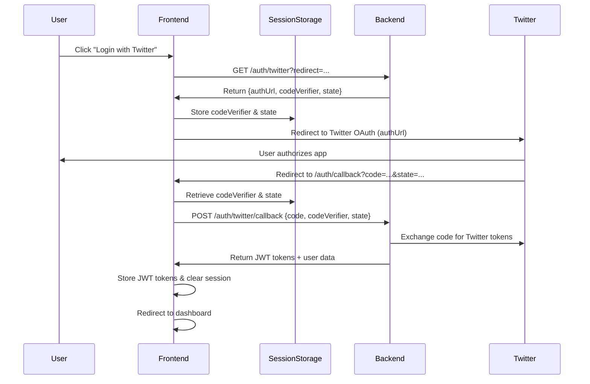

# 🔐 Bouncer Frontend - Authentication Setup Guide

## 🚀 Quick Start

The authentication system has been integrated and is ready to use! Follow these steps to get started:

### 1. Environment Setup

Make sure your `.env.local` file is configured:

```bash
# Backend API URL (adjust port if needed)
NEXT_PUBLIC_API_BASE_URL=http://localhost:3000/api/v1

# Application URLs
NEXT_PUBLIC_APP_URL=http://localhost:3001
NEXT_PUBLIC_TWITTER_OAUTH_CALLBACK_URL=http://localhost:3001/auth/callback
```

### 2. Backend Requirements

Ensure your backend is running with these environment variables:

```bash
# Twitter OAuth Configuration
TWITTER_CLIENT_ID=your_twitter_client_id
TWITTER_CLIENT_SECRET=your_twitter_client_secret
TWITTER_OAUTH_CALLBACK_URL=http://localhost:3001/auth/callback

# JWT Configuration
JWT_SECRET=your_jwt_secret_32_chars_min
JWT_REFRESH_SECRET=your_refresh_secret_32_chars_min
```

### 3. Start the Application

```bash
npm run dev
```

Visit `http://localhost:3001/login` and click "Continue with X (Twitter)" to test the authentication flow.

## 🏗️ Implementation Overview

### ✅ What's Been Integrated

1. **Twitter OAuth 2.0 Flow**
   - Secure PKCE implementation
   - CSRF protection with state parameter
   - Automatic token refresh

2. **API Service Enhancement**
   - Full backend endpoint integration
   - Automatic token management
   - Error handling and retry logic

3. **Authentication Hook**
   - `useAuth()` hook with Twitter OAuth methods
   - User state management
   - Loading and error states

4. **Protected Routes**
   - `ProtectedRoute` component for auth-required pages
   - Role-based access control
   - Automatic redirects

5. **UI Components**
   - `TwitterLoginButton` - Reusable OAuth button
   - `UserProfile` - User profile dropdown
   - OAuth callback page with loading states

### 📁 New Files Added

```
bouncer-frontend/
├── app/auth/callback/page.tsx          # OAuth callback handler
├── components/auth/
│   ├── ProtectedRoute.tsx              # Route protection
│   ├── TwitterLoginButton.tsx          # OAuth login button
│   └── UserProfile.tsx                 # User profile component
├── .env.local                          # Environment configuration
└── AUTHENTICATION_SETUP.md             # This guide
```

### 🔧 Modified Files

- `lib/hooks/use-auth.ts` - Enhanced with Twitter OAuth
- `lib/services/api.ts` - Backend integration & token management
- `lib/types/index.ts` - Updated User type for Twitter data
- `lib/constants/index.ts` - Backend API URL configuration
- `app/login/page.tsx` - Functional Twitter OAuth button
- `app/signup/page.tsx` - Functional Twitter OAuth button
- `app/dashboard/page.tsx` - Protected route implementation
- `components/dashboard-layout.tsx` - User profile integration

### **🔄 Authentication Flow**

### 1. Complete Login Process



### 2. Critical OAuth Data Flow

- **Step 1**: Backend generates `codeVerifier` and `state` for PKCE security
- **Step 2**: Frontend stores `codeVerifier` in sessionStorage (CRITICAL!)
- **Step 3**: User redirects to Twitter with `authUrl`
- **Step 4**: Twitter redirects back with `code` and `state`
- **Step 5**: Frontend retrieves stored `codeVerifier` for callback
- **Step 6**: Backend validates all parameters and issues JWT tokens

### 3. Token Management

- **Access Token**: Stored in localStorage, expires in 1 hour
- **Refresh Token**: Stored in localStorage, expires in 30 days
- **Automatic Refresh**: Handled by API service on 401 responses
- **OAuth Session**: Temporary data in sessionStorage (cleared after callback)
- **Logout**: Clears all tokens and redirects to login

## 🛠️ Usage Examples

### Basic Authentication Check

```tsx
import { useAuth } from '@/lib/hooks/use-auth';

function MyComponent() {
  const { user, isAuthenticated, isLoading } = useAuth();

  if (isLoading) return <div>Loading...</div>;
  if (!isAuthenticated) return <div>Please log in</div>;

  return <div>Welcome, @{user.username}!</div>;
}
```

### Protected Page

```tsx
import ProtectedRoute from '@/components/auth/ProtectedRoute';

export default function DashboardPage() {
  return (
    <ProtectedRoute>
      <div>This content requires authentication</div>
    </ProtectedRoute>
  );
}
```

### Twitter Login Button

```tsx
import TwitterLoginButton from '@/components/auth/TwitterLoginButton';

export default function LoginPage() {
  return (
    <TwitterLoginButton
      variant="outline"
      size="lg"
      redirectTo="/dashboard"
    />
  );
}
```

### User Profile Display

```tsx
import UserProfile from '@/components/auth/UserProfile';

export default function Header() {
  return (
    <div className="flex items-center justify-between">
      <h1>My App</h1>
      <UserProfile />
    </div>
  );
}
```

### API Calls with Authentication

```tsx
import { apiService } from '@/lib/services/api';

const fetchUserData = async () => {
  const response = await apiService.getCurrentUser();
  if (response.success) {
    console.log('User data:', response.data);
  }
};
```

## 🔒 Security Features

- **PKCE OAuth 2.0**: Prevents authorization code interception
- **CSRF Protection**: State parameter validation
- **Secure Token Storage**: localStorage with automatic cleanup
- **Token Refresh**: Automatic renewal without user interaction
- **Role-Based Access**: Optional role checking in protected routes
- **Rate Limiting**: Backend-enforced request limits

## 🚨 Error Handling

The authentication system handles various error scenarios:

- **OAuth Cancellation**: User-friendly message when user cancels
- **Token Expiry**: Automatic refresh or redirect to login
- **Network Errors**: Graceful fallback with retry options
- **Invalid State**: CSRF attack prevention
- **Backend Errors**: Clear error messages to users

## 📱 Responsive Design

All authentication components are fully responsive and work across:
- Desktop browsers
- Mobile devices
- Tablet interfaces
- Dark/light mode compatible

## 🧪 Testing the Integration

### 1. Test Login Flow

1. Navigate to `/login`
2. Click "Continue with X (Twitter)"
3. **Check sessionStorage** - should have `oauth_code_verifier` and `oauth_state`
4. Complete Twitter OAuth authorization
5. **Check callback** - URL should have `code` and `state` parameters
6. Should redirect to `/dashboard` as authenticated user
7. **Check localStorage** - should have `bouncer_access_token` and `bouncer_refresh_token`

### 2. Test Protected Routes

1. Visit `/dashboard` without authentication
2. Should redirect to `/login`
3. After login, should access dashboard successfully

### 3. Test Token Refresh

1. Login and wait for token to expire (or manually clear `bouncer_access_token`)
2. Make an API call that requires authentication
3. Should automatically refresh using `bouncer_refresh_token` and retry

### 4. Test Logout

1. Click user profile dropdown
2. Select "Sign out"
3. Should clear tokens and redirect to home

## 🔧 Troubleshooting

### Common Issues

**Twitter OAuth fails:**
- Check TWITTER_CLIENT_ID and TWITTER_CLIENT_SECRET in backend
- Verify callback URL matches in Twitter Developer Console: `http://localhost:3001/auth/callback`
- Ensure backend is running on correct port (3000)
- Check backend logs for validation errors

**"Missing code verifier" error:**
- Most common issue! Check sessionStorage has `oauth_code_verifier`
- Ensure sessionStorage isn't cleared between initiate and callback
- Check if user refreshed page during OAuth flow

**Tokens not persisting:**
- Check localStorage in browser dev tools
- Verify `NEXT_PUBLIC_API_BASE_URL=http://localhost:3000/api/v1`
- Check CORS configuration in backend
- Ensure cookies are being set correctly

**403/401 Errors:**
- Verify JWT_SECRET is configured in backend
- Check token expiration times in backend config
- Ensure refresh token is being stored and retrieved
- Check if backend validation is rejecting requests

### Debug Mode

Set `NEXT_PUBLIC_ENABLE_DEBUG=true` in `.env.local` for detailed logging.

#### OAuth Flow Debugging:
1. Open browser dev tools (Console & Application tabs)
2. Check console logs for `[OAuth]` messages during login
3. Inspect sessionStorage for OAuth temporary data
4. Inspect localStorage for JWT tokens
5. Check Network tab for API calls and responses

#### Using AuthStatus Component:
```tsx
import AuthStatus from '@/components/auth/AuthStatus';

// Add to any page during development
<AuthStatus showDetails={true} />
```

## 🚀 Production Deployment

For production deployment:

1. Update environment variables:
```bash
NEXT_PUBLIC_API_BASE_URL=https://your-backend-domain.com/api/v1
NEXT_PUBLIC_APP_URL=https://your-frontend-domain.com
NEXT_PUBLIC_TWITTER_OAUTH_CALLBACK_URL=https://your-frontend-domain.com/auth/callback
```

2. Configure Twitter Developer Console with production URLs
3. Ensure HTTPS is enabled for security
4. Set secure cookie flags in backend
5. Configure CORS for production domains

## 📞 Support

If you encounter issues:

1. Check this guide first
2. Verify backend logs for authentication errors
3. Check browser console for frontend errors
4. Ensure all environment variables are set correctly

The authentication system is now fully integrated and ready for production use! 🎉